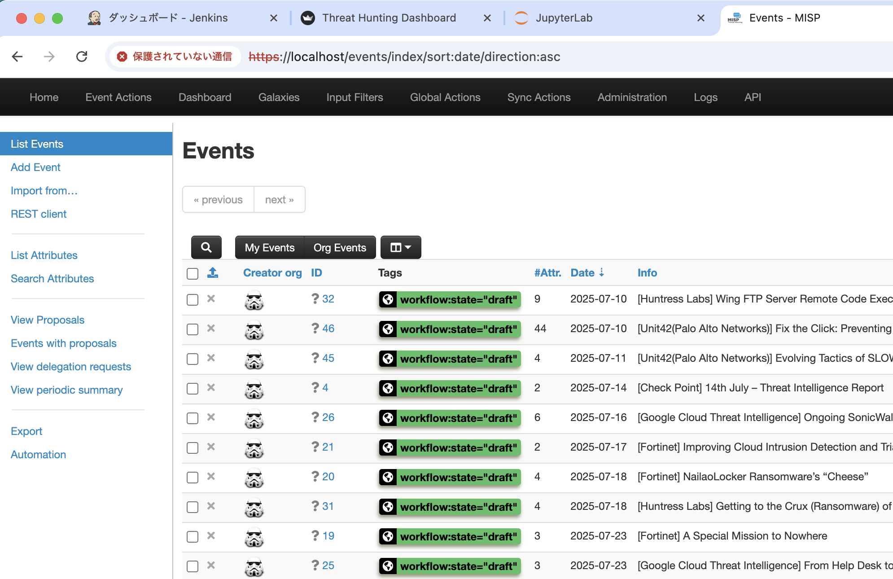

# 🛡️THuntLab

A comprehensive threat hunting laboratory environment that integrates Jenkins CI/CD, Streamlit analytics dashboard, and MISP threat intelligence platform using Docker containers.

## Architecture

The platform consists of four main services running in Docker containers:

1. **Jenkins** (Port 8080): Executes automated threat hunting jobs
2. **Streamlit App** (Port 8081): Provides interactive data analysis interface
3. **MISP** (Ports 80/443): Manages threat intelligence data


## Prerequisites

- [Docker Engine/ Docker Compose](https://docs.docker.com/engine/install/)
- Git (for submodules)
- Make

## Quick Start

1. **Clone the repository with submodules:**
   ```bash
   git clone https://github.com/fukusuket/THuntLab.git
   cd THuntLab
   ```

2. **Build and start all services:**
   ```bash
   sudo make dev
   ```

3. **Access the services:**
   - Jenkins: http://localhost:8080
   - Streamlit Dashboard: http://localhost:8081
   - MISP Platform: https://localhost
      - (email: admin@admin.test / password: admin)

## Screenshots
After quick start, you can access the following dashboards:




## Available Commands

Use the included Makefile for easy service management:

### General Commands
- `make build` - Build all services
- `make up` - Start all services
- `make down` - Stop all services
- `make restart` - Restart all services
- `make logs` - Show logs for all services
- `make status` - Check service status
- `make clean` - Remove all services and volumes
- `make dev` - Build and start all services

## Shared Directory

The `./shared` directory serves as a common workspace:

- `hunt.py`: Example threat hunting script executed by Jenkins
- `cti.py`: Example script for MISP interaction
- `streamlit.py`: Streamlit dashboard application
- Additional scripts and data files can be placed here for cross-service access

## Security Considerations

**Warning**: This configuration is designed for laboratory and educational purposes. It includes several security settings that are NOT suitable for production environments:

- Jenkins authentication is disabled
- CSRF protection is disabled
- Anonymous users have full administrative access

For production use, implement proper authentication, authorization, and security controls.

## Development

### Adding New Hunt Scripts

1. Place Python scripts in the `./shared` directory
2. Create new Jenkins jobs to execute them
3. Use the Streamlit dashboard to visualize results

### Customizing the Dashboard

Modify `./shared/streamlit.py` to create custom visualizations and analytics interfaces for your threat hunting data.

### MISP Integration

Configure MISP to share threat intelligence data with your hunting scripts and dashboard through the shared volume or API connections.

## Troubleshooting

- Check container logs: `make logs`
- Verify port availability (8080, 8081, 80, 443)
- Ensure Docker daemon is running

## Contributing

Contributions are welcome!

### Steps
1. Fork this repo
2. Create a branch: `git checkout -b your-feature`
3. Make changes and test them
4. Submit a pull request

Questions? Open an issue!

## License

This project is licensed under the MIT License - see the LICENSE file for details.

## Acknowledgments

- [MISP](https://www.misp-project.org/) Project for the threat intelligence platform
- [Jenkins](https://www.jenkins.io/) community for the automation server
- [Streamlit](https://streamlit.io/) team for the data application framework